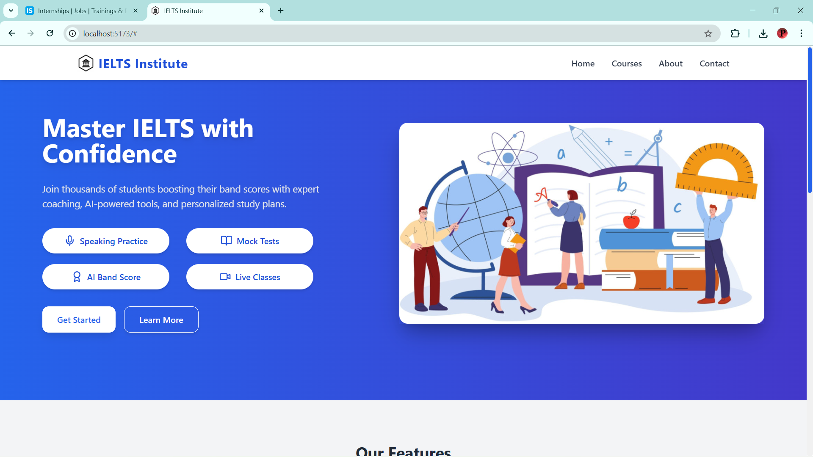
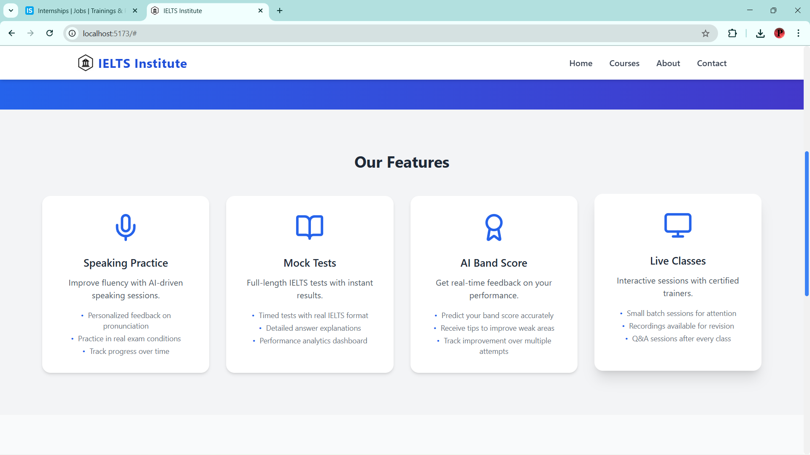
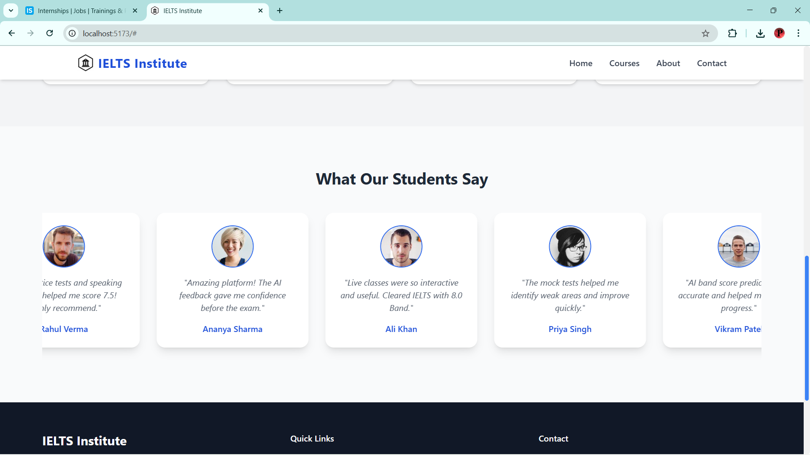
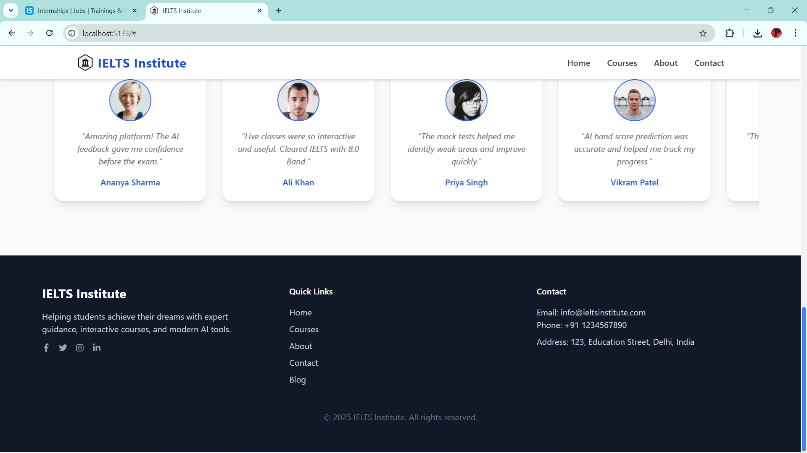

# IELTS Institute Landing Page

A modern, responsive landing page for a fictional IELTS institute built using **React.js**, **Tailwind CSS**, and **Vite**. This project was completed as part of a Full Stack Development internship assignment.

---

## Features

- **Responsive Design** – Works seamlessly on mobile, tablet, and desktop.  
- **Hero Section** – Includes headline, subtext, CTA buttons, and a featured image with hover effect.  
- **Interactive Feature Cards** – 4 key features: Speaking Practice, Mock Tests, AI Band Score, Live Classes.  
- **Student Testimonials** – Continuous auto-scrolling carousel with 6 student reviews.  
- **Footer** – Contains contact info, quick links, and social media icons.  
- **Modern UI Effects** – Shadows, hover animations, and proper spacing to give a professional look.

---

## Installation (Windows + npm)

Clone this repository and set up the project:

```bash
git clone https://github.com/pranavmakesitcool24k/ielts-institute.git
cd ielts-institute
npm install
npm run dev
Open http://localhost:5173/ in your browser to view the page.
```

## Author

Pranav Pardeshi 💜

---
### Screenshots





